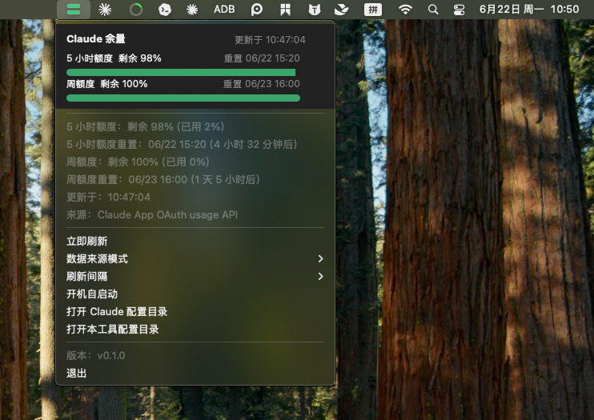

# Claude Quota Tray for macOS

极简 macOS 菜单栏工具，用于查看 Claude Code 当前订阅额度。本仓库是 macOS 工程；Windows 版本请看 [qx0657/claude-quota-windows](https://github.com/qx0657/claude-quota-windows)。

实现思路参考 Windows 版，但使用原生 Swift/AppKit，依赖只来自 macOS 系统框架。

## 截图

菜单栏悬停提示：


菜单详情：



## 功能

- 菜单栏图标显示两条余量条：上方为 5 小时额度，下方为周额度。
- 点击菜单栏图标打开菜单。
- 菜单中用两行进度条显示 5 小时额度和周额度。
- 显示重置时间、更新时间和获取失败原因。
- 支持手动刷新、刷新间隔、开机自启动。
- 支持主动模式、被动模式和自动兜底模式，默认使用主动模式。
- 支持 Claude App 本地 OAuth 缓存和 Claude Code statusLine 数据，不保存 Claude token。

## 数据来源模式

菜单里的“数据来源模式”可以选择三种方式。

### 主动模式（默认）

主动模式读取 Claude App 本地 OAuth 缓存，并请求 Anthropic usage API：

```text
https://api.anthropic.com/api/oauth/usage
```

macOS 版会从 `~/Library/Application Support/Claude/config.json` 读取加密 OAuth cache，并通过系统 Keychain 的 `Claude Safe Storage` 只在内存中解密 access token。工具不会把 access token、refresh token 或 Cookie 写入自己的目录。

成功拿到的 usage 响应会缓存到：

```text
~/Library/Application Support/ClaudeQuotaTray/claude-app-usage.json
```

这个缓存只包含用量百分比、重置时间等非敏感数据。

### 被动模式

```text
~/Library/Application Support/ClaudeQuotaTray/statusline-usage.json
```

被动模式只读取 Claude Code statusLine 缓存。它不主动请求服务端，数据新不新取决于 Claude Code 最近一次 API 响应里是否带了新的 `rate_limits`。

首次使用被动模式时，在菜单点击：

```text
数据来源模式 > 安装/更新被动模式采集器
```

然后在 Claude Code 中发送任意一条消息。Claude Code 收到 API 响应后会把 `rate_limits.five_hour` 和 `rate_limits.seven_day` 传给状态栏脚本，脚本会把额度写入 `statusline-usage.json`。

### 自动兜底模式

自动兜底模式先使用主动模式；如果主动模式失败，再尝试 30 分钟内的主动缓存、statusLine 被动缓存，以及旧版 Claude Code `.credentials.json`。

## 构建和运行

开发运行：

```bash
swift run -c release
```

发布 `.app`：

```bash
./build.sh
```

输出路径：

```text
publish/ClaudeQuotaTray.app
```

打包 DMG：

```bash
./package-dmg.sh
```

输出路径：

```text
publish/ClaudeQuotaTray.dmg
```

如果 macOS 阻止直接打开未签名应用，可以在 Finder 里右键选择“打开”，或从终端启动：

```bash
open publish/ClaudeQuotaTray.app
```

## 本地数据

应用自己的配置位于：

```text
~/Library/Application Support/ClaudeQuotaTray/config.json
```

不会把 Claude access token、refresh token 或 Cookie 写入该目录，只会保存非敏感的 usage 百分比、重置时间、刷新间隔和数据来源模式。

## 说明

Claude Code 的 statusLine 数据来自官方支持的状态栏机制。`rate_limits` 只有在 Claude Code 收到 API 响应后才会出现；如果需要按预设周期主动刷新，请使用主动模式。

## Credits

本项目由用户提出需求与使用场景，Codex 参与设计、实现、调试与文档完善。
